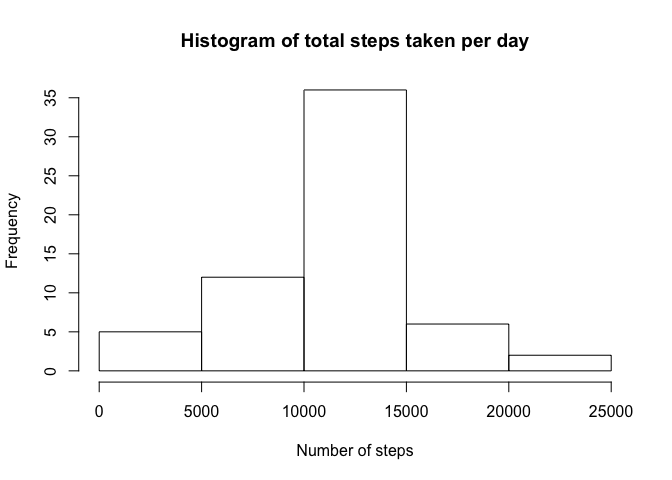
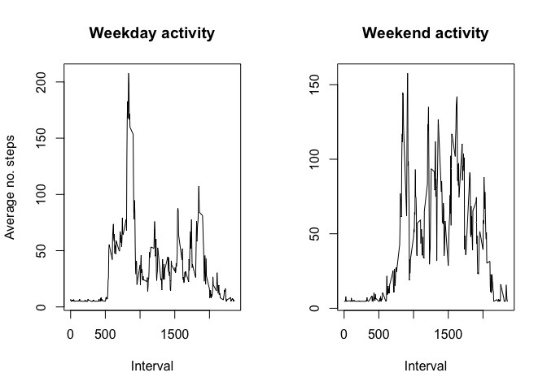

#Bryant Gagliardi Course Project 1

Read in the data

```r
#Set the working directory
setwd ("/Users/bryantgagliardi/Documents/data_course/Project_1")
        #read in the data
        stepdata <- (read.csv("activity.csv", header=TRUE))
```


What is mean total number of steps taken per day?

```r
# 1. Calculate the total number of steps taken per day:
#remove NAs for this part of the analysis
completesteps <- na.omit(stepdata)
#load the plyr package
library(plyr)
#summarise and sum the steps data by date, into a dataframe
dailysteps <- 
        ddply(completesteps, .(date), summarize, daily_total_steps = sum(steps))
        

#2. Make histogram of the number of steps taken each day:
#assign "number of steps per day" as a variable
daily_total_steps <- dailysteps$daily_total_steps
        #make a labelled histogram 
        hist(daily_total_steps, main = "Histogram of total steps taken per day",
        xlab = "Number of steps", ylab = "Frequency")
```

<!-- -->

```r
#3. Calculate and report the mean and median of the total number of steps taken 
#per day:
#take the mean of all daily step values in the "dailysteps" dataframe"
rmean <- mean(dailysteps[,"daily_total_steps"])
        #take the median of all daily step values
        rmedian <- median(dailysteps[,"daily_total_steps"])
```

The mean number of steps taken per day is 1.0766189\times 10^{4}, the median number of steps
is 10765.


What is the average daily activity pattern?


```r
#1.Make a time series plot:
#summarise and average the steps data by interval, into a dataframe
intervalsteps <- ddply(completesteps, .(interval), summarize, 
                       mean_steps_per_interval = mean(steps))
        #assign the relevant variables for the plot
        int <- intervalsteps$interval
        ave_steps <- intervalsteps$mean_steps_per_interval
        #create the timeseries plot
        plot(int, ave_steps, type = "l", main = "Daily activity",
                xlab = "Interval", ylab = "Average no. steps")
```

<!-- -->

```r
#2. Which interval has the max average steps?       
        #determine which row in the dataset has the highest average steps
        maxinterval <- which(ave_steps==max(ave_steps))
        #determine which interval corresponds to this row
        moststeps <- intervalsteps[maxinterval,"interval"]
```
The most steps on average are taken in interval number 835.


Imputing missing values

```r
#1. Calculate and report number of missing values:
#count the number of steps "NA" values in the original dataset
        StepNAs <- sum(is.na(stepdata$steps))

#2. Devise a strategy for filling in NAs:
        #replace NAs with the average number of steps per interval
#3. Create a new dataset that is equal to the original but with missing data 
        #added:
#fill in NAs with the average number of steps per interval
stepdata[is.na(stepdata)] <- mean(completesteps$steps)
        
#4.Make a histogram of steps taken each day,
imputedsteps <- 
        ddply(stepdata, .(date), summarize, daily_total_steps = sum(steps))

        hist(imputedsteps$daily_total_steps, main = 
        "Histogram of total steps taken per day",
        xlab = "Number of steps", ylab = "Frequency")
```

<!-- -->

```r
#...calculate the mean and median total number of steps taken per day
       MnDTS <- mean(imputedsteps$daily_total_steps)
       MdDTS <- median(imputedsteps$daily_total_steps)
       meandiff <- MnDTS - rmean
       meddiff <- MdDTS - rmedian
```
1. There are 2304 NA values in the dataset
4. The mean total number of daily steps taken is 1.0766189\times 10^{4}, the median total
number of daily steps taken is 1.0766189\times 10^{4}. The difference between the mean
with imputed values and the mean without imputed values is 0. The 
difference between the median with imputed values and the median without imputed 
values is 1.1886792. 


Are there differences in activity patterns between weekdays and weekends?

```r
#1. Create a new factor variable in the dataset with two levels - 
#"weekday" and "weekend":
#for days containing capital S, assign them weekends, otherwise weekdays
stepdata$day = weekdays(as.Date(stepdata$date))
        stepdata$WD <- ifelse(grepl("S", stepdata$day, ignore.case=FALSE), 
                              "Weekend","Weekday")

#2. Make panel plot comparing activity for weekdays and weekends:
        #make separate weekday and weekend datasets
        wkdy <- stepdata[which(stepdata$WD == 'Weekday'),]
        wknd <- stepdata[which(stepdata$WD == 'Weekend'),]
        #average the steps per interval for each dataset
        wkdysteps <- ddply(wkdy, .(interval), summarize, 
                       mean_steps_per_interval = mean(steps))

        wkndsteps <- ddply(wknd, .(interval), summarize, 
                       mean_steps_per_interval = mean(steps))
        #plot the results for comparison
        par(mfrow=c(1,2))
        plot(x=wkdysteps$interval,y=wkdysteps$mean_steps_per_interval, 
             type="l", ylab = "Average no. steps", xlab = "Interval", 
             main = "Weekday activity")
        plot(wkndsteps$interval,wkndsteps$mean_steps_per_interval, 
             type="l",ylab="", xlab = "Interval", main="Weekend activity")
```

<!-- -->
